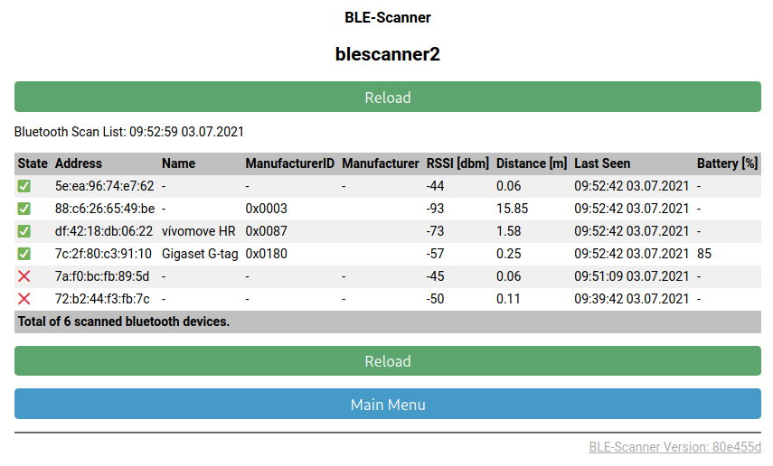
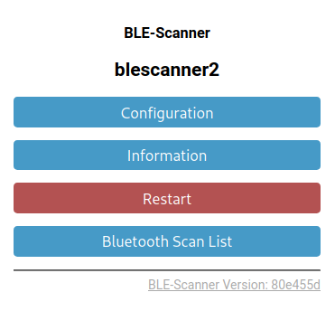
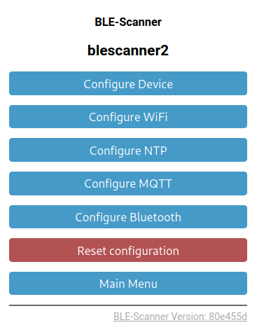
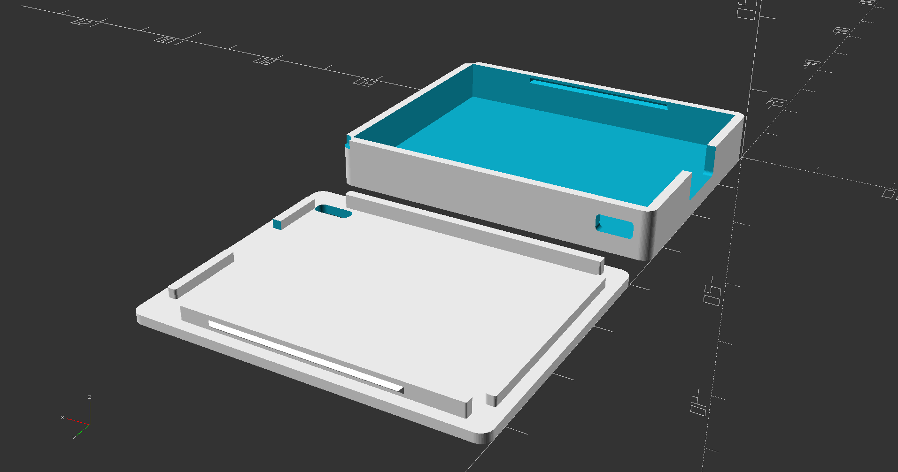

# BLE-Scanner

ESP32-based Bluetooth Low Energy (BLE) scanner to report presence of bluetooth devices into an MQTT service.

## Challenge

Nowadays more and more bluetooth devices are around for personal use, like smart phones or smart watches. Why not use these devices to check presence of tenants at home?

There are [already some solutions around](https://github.com/search?q=ble+scan+esp32&type=Repositories). So why add another one?

I was quite astonished how many devices are detected if you scan the air for bluetooth. Only a few of these report their name, so its hard to distinguish these. The [Bluetooth list of manufacturers](https://www.bluetooth.com/specifications/assigned-numbers/company-identifiers/) helps here.

## Solution

I used an [Espressif ESP32](https://www.espressif.com/en/products/socs/esp32) device which has WiFi and Bluetooth on-board (e.g. the Mini D1). The bluetooth scan results are published to an MQTT server via WiFi.

The BLE scanning device is configured via a Web Frontend which is inspired by [Tasmota](https://github.com/arendst/Tasmota).

The BLE-Scanner doesn't need any external circuit -- just flash the software on it and configure the device.

## Prepare the build environment

To intall the ESP32 device support in the Arduino IDE, do as follows:

* Open the preferences in the Arduino IDE and add the following URLs to the _Additional Boards Manager URLs_ 
  * [https://dl.espressif.com/dl/package_esp32_index.json](https://dl.espressif.com/dl/package_esp32_index.json)
* Open the _Boards Manager_ and search for `esp32`. Install the found library.  
* Under `Tools`
  * select the Board `ESP32 Arduino` and your matching variant which was `WEMOS D1 MINI ESP32` in my case. This depends on the board you use.
  * select the hightest `Upload Speed`
  * select the right `CPU Frequency` for your board
  * select the `Flash Frequency`of `80MHz`
  * select the `Partition Scheme` of `Minimal SPIFFS (Large APPS with OTA)`
* Under `Tools` - `Manage Libraries` install the following libraries, if not yet installed:
  * `NimBLE-Arduino` - see [https://github.com/h2zero/NimBLE-Arduino](https://github.com/h2zero/NimBLE-Arduino) for documentation
  * `PubSubClient` - see [https://pubsubclient.knolleary.net/](https://pubsubclient.knolleary.net/) for documentation
  * `Time` see [https://playground.arduino.cc/Code/Time/](https://playground.arduino.cc/Code/Time/) for documentation

## Update Procedure (OTA)

Once you have the ESP32 device flashed with the BLE-Scanner, and maybe distributed a few of these devices in your infrastructure,
you can use the Firemware Upgrade procedure where a new build SW version can by flashed over the air (OTA).
Select _Export compiled Binary_ under the 'Sketch' menu and upload the resulting file in the sketchs home in the BLE-Scanner.

## Initialization Procedure

Whenever the BLE-Scanner starts and is not able to connect to your WiFi (eg. because of a missing configuration due to a fresh installation), it enters the configuration mode.
In configuration mode the BLE-Scanner opens an WiFi Access Point with the SSID `BLE-Scanner-AP-XX:XX:XX`. Connect to it with your smartphone or notebook and configure at lease the WiFi settings. Than restart the BLE-Scanner, and continue the configuration.

To flash, open the sketch, build and upload to a connected ESP32. Then follow the **Initialization Procedure** above.

## What is in this respository?

### [BLE-Scanner Sketch](BLE-Scanner/)

This is the sketch for the ESP32 micro controller. Use the [ArduinoIDE](https://www.arduino.cc/en/main/software) to compile and upload into the ESP32 micro controller.

Follow the section **Prepare the build environtment** above, then open the sketch in the Arduino IDE to build and upload to a connected ESP32.
Then follow the **Initialization Procedure** above.

### [Case](Case/)

In this directory you will find a 3D model of an enclosure for the device.
These models are designed with [OpenSCAD](https://www.openscad.org/). Use the latest version of OpenSCAD (nightly build).
The lower and upper shells of the enclosure are simply snapped together -- without any screws.

### [Scripts](Ressources/Scripts/)

Thie directory holds the helper script to download and activate the bluetooth manufacturer list.

### [Screenshots](Ressources/Screenshots/)

Thie directory holds some screenshots of the web interface.
